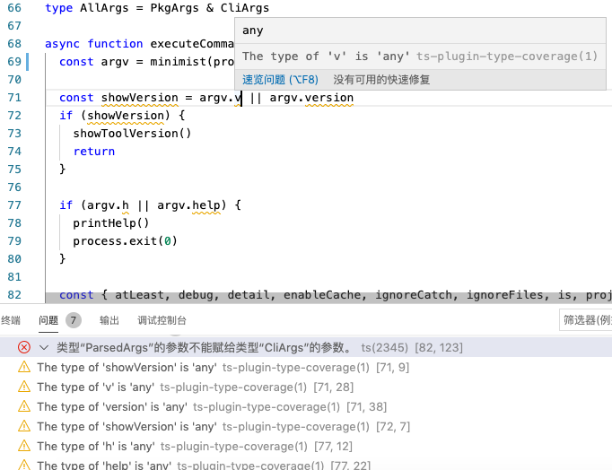

# type-coverage

A CLI tool to check type coverage for typescript code

This tool will check type of all identifiers, `the type coverage rate` = `the count of identifiers whose type is not any` / `the total count of identifiers`, the higher, the better.

[](https://david-dm.org/plantain-00/type-coverage)
[](https://david-dm.org/plantain-00/type-coverage#info=devDependencies)
[](https://ci.appveyor.com/project/plantain-00/type-coverage/branch/master)

[](https://badge.fury.io/js/type-coverage)
[](https://www.npmjs.com/package/type-coverage)
[](https://github.com/plantain-00/type-coverage)
[](https://codechecks.io)

## use cases

+ Show progress of long-term progressive migration from existing js code to typescript code.
+ Avoid introducing accidental `any` by running in CI.

## install

`yarn global add type-coverage`

## usage

run `type-coverage`

## arguments

name | type | description
--- | --- | ---
`-p`, `--project` | string? | tell the CLI where is the `tsconfig.json`(Added in `v1.0`)
`--detail` | boolean? | show detail(Added in `v1.0`)
`--at-least` | number? | fail if coverage rate < this value(Added in `v1.0`)
`--debug` | boolean? | show debug info(Added in `v1.0`)
`--strict` | boolean? | [strict mode](#strict-mode)(Added in `v1.7`)
`--ignore-catch` | boolean? | [ignore catch](#ignore-catch)(Added in `v1.13`)
`--cache` | boolean? | [enable cache](#enable-cache)(Added in `v1.10`)
`--ignore-files` | string[]? | [ignore files](#ignore-files)(Added in `v1.14`)
`-h`, `--help` | boolean? | show help(Added in `v2.5`)
`--is` | number? | fail if coverage rate !== this value(Added in `v2.6`)
`--update` | boolean? | update "typeCoverage" in package.json to current result(Added in `v2.6`)
`--ignore-unread` | boolean? | allow writes to variables with implicit any types(Added in `v2.14`)
`--ignore-nested` | boolean? | ignore any in type arguments, eg: `Promise<any>`(Added in `v2.16`)
`--ignore-as-assertion` | boolean? | ignore as assertion, eg: `foo as string`(Added in `v2.16`)
`--ignore-type-assertion` | boolean? | ignore type assertion, eg: `<string>foo`(Added in `v2.16`)
`--ignore-non-null-assertion` | boolean? | ignore non-null assertion, eg: `foo!`(Added in `v2.16`)
`--show-relative-path` | boolean? | show relative path in detail message(Added in `v2.17`)
`--history-file` | string? | file name where history is saved(Added in `v2.18`)
`--no-detail-when-failed` | boolean? | not show detail message when the CLI failed(Added in `v2.19`)

### strict mode

If the identifiers' type arguments exist and contain at least one `any`, like `any[]`, `ReadonlyArray<any>`, `Promise<any>`, `Foo<number, any>`, it will be considered as `any` too(Added in `v1.7`)

Type assertion, like `foo as string`, `foo!`, `<string>foo` will be considered as uncovered, exclude `foo as const`, `<const>foo`, `foo as unknown`(Added in `v2.8`), and other safe type assertion powered by `isTypeAssignableTo`(Added in `v2.9`)

Also, future minor release may introduce stricter type check in this mode, which may lower the type coverage rate

### enable cache

save and reuse type check result of files that is unchanged and independent of changed files in `.type-coverage` directory, to improve speed

### ignore catch

If you want to get 100% type coverage then `try {} catch {}` is
the largest blocked towards that.

This can be fixed in typescript with [Allow type annotation on catch clause variable](https://github.com/Microsoft/TypeScript/issues/20024)
but until then you can turn on `--ignore-catch --at-least 100`.

Your catch blocks should look like

```ts
try {
  await ...
} catch (anyErr) {
  const err = <Error> anyErr
}
```

To have the highest type coverage.

### ignore files

This tool will ignore the files, eg: `--ignore-files "demo1/*.ts" --ignore-files "demo2/foo.ts"`

## config in package.json

```json5
  "typeCoverage": {
    "atLeast": 99, // same as --at-least (Added in `v1.4`)
    "is": 99, // same as --is (Added in `v2.6`)
    "cache": true, // same as --cache (Added in `v2.11`)
    "debug": true, // same as --debug (Added in `v2.11`)
    "detail": true, // same as --detail (Added in `v2.11`)
    "ignoreCatch": true, // same as --ignore-catch (Added in `v2.11`)
    "ignoreFiles": ["demo1/*.ts", "demo2/foo.ts"], // same as --ignore-files "demo1/*.ts" --ignore-files "demo2/foo.ts" (Added in `v2.11`)
    "project": "tsconfig.json", // same as --project tsconfig.json or -p tsconfig.json (Added in `v2.11`)
    "strict": true, // same as --strict (Added in `v2.11`)
    "suppressError": true, // same as --suppressError (Added in `v2.11`)
    "update": true, // same as --update (Added in `v2.11`)
    "ignoreUnread": true, // same as --ignore-unread (Added in `v2.14`)
    "ignoreNested": true, // same as --ignore-nested (Added in `v2.16`)
    "ignoreAsAssertion": true, // same as --ignore-as-assertion (Added in `v2.16`)
    "ignoreTypeAssertion": true, // same as --ignore-type-assertion (Added in `v2.16`)
    "ignoreNonNullAssertion": true, // same as --ignore-non-null-assertion (Added in `v2.16`)
    "showRelativePath": true, // same as --show-relative-path (Added in `v2.17`)
    "historyFile": "typecoverage.json", // same as --history-file (Added in `v2.18`)
    "noDetailWhenFailed": true, // same as --no-detail-when-failed (Added in `v2.19`)
  },
```

## ignore line

Use `type-coverage:ignore-next-line` or `type-coverage:ignore-line` in comment(`//` or `/*  */`) to ignore `any` in a line.(Added in `v1.9`)

```ts
try {
  // type-coverage:ignore-next-line
} catch (error) { // type-coverage:ignore-line
}
```

## add dynamic badges of type coverage rate

Use your own project url:

```md
[](https://github.com/plantain-00/type-coverage)
```

## integrating with PRs

Using [codechecks](https://codechecks.io) you can integrate `type-coverage` with GitHub's Pull Requests. See [type-coverage-watcher](https://github.com/codechecks/type-coverage-watcher).

[](https://github.com/codechecks/type-coverage-watcher)

## typescript coverage report

Using [typescript-coverage-report](https://github.com/alexcanessa/typescript-coverage-report) you can generate typescript coverage report.

[](https://github.com/alexcanessa/typescript-coverage-report)

## API(Added in `v1.3`)

```ts
import { lint } from 'type-coverage-core'

const result = await lint('.', { strict: true })
```

```ts
export function lint(project: string, options?: Partial<LintOptions>): Promise<FileTypeCheckResult & { program: ts.Program }>
export function lintSync(compilerOptions: ts.CompilerOptions, rootNames: string[], options?: Partial<LintOptions>): FileTypeCheckResult & { program: ts.Program } // Added in `v2.12`

export interface LintOptions {
  debug: boolean,
  files?: string[],
  oldProgram?: ts.Program,
  strict: boolean, // Added in v1.7
  enableCache: boolean, // Added in v1.10
  ignoreCatch: boolean, // Added in v1.13
  ignoreFiles?: string | string[], // Added in v1.14
  fileCounts: boolean, // Added in v2.3
  absolutePath?: boolean, // Added in v2.4
  processAny?: ProccessAny, // Added in v2.7
  ignoreUnreadAnys: boolean, // Added in v2.14
  ignoreNested: boolean // Added in v2.16
  ignoreAsAssertion: boolean // Added in v2.16
  ignoreTypeAssertion: boolean // Added in v2.16
  ignoreNonNullAssertion: boolean // Added in v2.16
}

export interface FileTypeCheckResult {
  correctCount: number
  totalCount: number
  anys: FileAnyInfo[]
  fileCounts: { // Added in v2.3
    correctCount: number,
    totalCount: number,
  }[]
}

export interface FileAnyInfo {
  line: number
  character: number
  text: string
  kind: FileAnyInfoKind //  Added in v2.13
}

export const enum FileAnyInfoKind {
  any = 1, // any
  containsAny = 2, // Promise<any>
  unsafeAs = 3, // foo as string
  unsafeTypeAssertion = 4, // <string>foo
  unsafeNonNull = 5, // foo!
}

export type ProccessAny = (node: ts.Node, context: FileContext) => boolean
```

## The typescript language service plugin of type-coverage(Added in `v2.12`)



`yarn add ts-plugin-type-coverage -D`

```json5
{
  "compilerOptions": {
    "plugins": [
      {
        "name": "ts-plugin-type-coverage",
        "strict": true, // for all configurations, see LintOptions above
        "ignoreCatch": true,
      }
    ]
  }
}
```

For VSCode users, choose "Use Workspace Version", See <https://github.com/microsoft/TypeScript/wiki/Writing-a-Language-Service-Plugin#testing-locally>, or just use the wrapped plugin below.

## VSCode plugin(Added in `v2.13`)

<https://marketplace.visualstudio.com/items?itemName=york-yao.vscode-type-coverage>

Configuration is in `Preferences` - `Settings` - `Extensions` - `Type Coverage`

If the result from the vscode plugin is different from the result from the CLI, maybe your project root directory's `tsconfig.json` is different from your CLI `tsconfig.json`

If the plugin does not work, you may see some workarounds:

+ <https://github.com/plantain-00/type-coverage/issues/86#issuecomment-907814000>

## FAQ

> Q: Does this count JavaScript files?

Yes, This package calls Typescript API, Typescript can parse Javascript file(with `allowJs`), then this package can too.

## Changelogs

[CHANGELOG for minor and patch release](./CHANGELOG.md)

### v2

1. Move `typescript` from `dependencies` to `peerDependencies`
2. Move API from package `type-coverage` to package `type-coverage-core`

```ts
// v1
import { lint } from 'type-coverage'
lint('.', false, false, undefined, undefined, true)

// v2
import { lint } from 'type-coverage-core'
lint('.', { strict: true })
```
